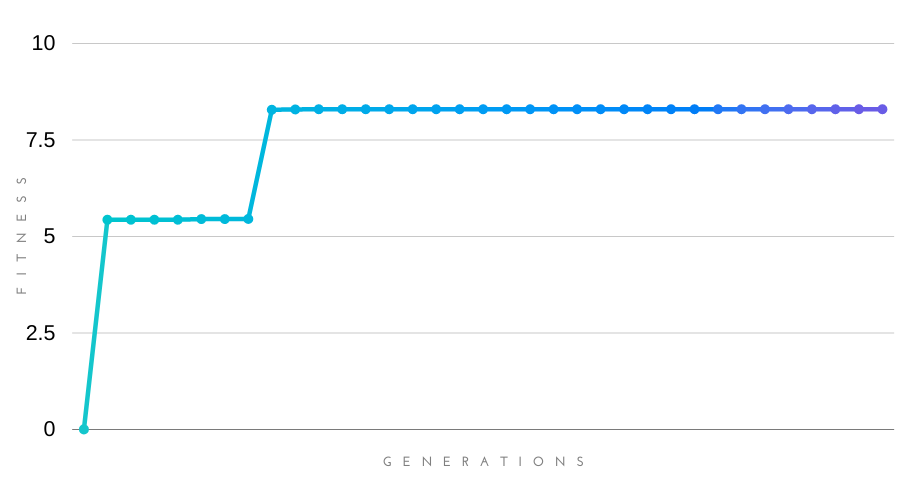
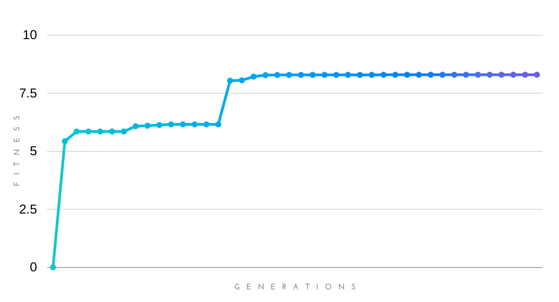
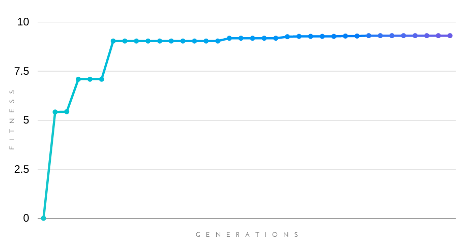
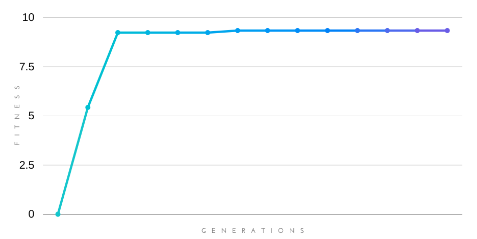

# Week 4 Progress

## Goal

Develop and test a neural network storage format that will involve integration with the persistent models system of Darwin. Eventually, results for the new extension will be generated, outlining its performance. Patterns in the training process will also be observed and noted.

## Neural Network Storage Format

`tinyai` has its own storage format for the neural networks, which looks something like this:

```
non-recurrent\n6\n\n1 0\n\n\n1 0\n\n\n1 0\n\n\n2 4\n1 0.0594683 0 -0.462274 4 0.394442 5 0.563337 \n\n0 2\n0 1.06421 1 -0.233392 \n\n0 1\n4 1.07719 \n\n
```

The following parameters of the genes are stored:

- The ANN type (currently only non-recurrent NNs are supported)
- Nodes
	- Node type
	- Number of inward connections
	- Inward connections
		- Inward connection ID and weight

> The neural networks are stored instead of genes because of the fact that the eventual goal of the system is to train and produce fit neural networks, which are the end products. Genes are part of the system only for neuroevolution.

## Integration With the Persistent Models System

The persistent models system of Darwin stores the best-fit models (neural networks in this case) in the format generated by `tinyai`. It's integrated with Pong through a GDNative library, which in turn is used in GDScript to connect with the entirety of the game framework.

### Functions of the GDNative Library

- `initiate` for loading the models file.
- `model` for fetching individual model.
- `count` for counting the number of models.
- `stage` for staging a specified model.
- `commit` for committing a selected number of models.
- `save` for writing the changes to the models file.

### Loading the Models

```python
# Load models
PersistentModels.initiate(Global.configuration.models_file_path)
```

### Updating at the End of Every Generation

After the end of every generation, the models are staged, committed and saved.

This is how each model is staged:

```python
PersistentModels.stage(Neat.model_to_string(model_id), score)
```

This is how a commit and save is done:

```python
PersistentModels.commit(Global.configuration.saved_models_count)
PersistentModels.save()
```

### Checking if There Are No Saved Models

This is a snippet that checks if no saved model exists in the file.

```python
var count = PersistentModels.count()

if count == 0:
    print("No saved model found.")
    return
```

## Results

The results below are fitness vs. generations graphs of 4 training sessions, with each training session being run until it reached a plateau. Population size is varied in each training session.

Parameters shared by all the training sessions:

|Parameter | Value|
|----------|------|
delta\_disjoint | 2.00
delta\_weights | 0.40
delta_threshold | 1.30
stale_species | 15
connection\_mutate\_chance | 0.25
perturb\_chance | 0.90
crossover\_chance | 0.75
link_mutation\_chance | 2.00
node_mutation\_chance | 0.50
bias_mutation\_chance | 0.40
disable_mutation\_chance | 0.40
enable_mutation\_chance | 0.20

### 50 Genes



### 100 Genes



### 300 Genes



### 600 Genes



## Observations and Notes

> TODO

